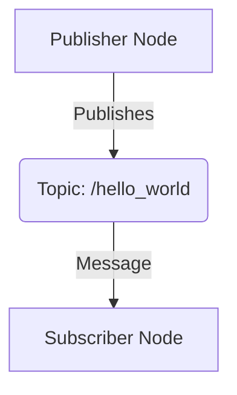
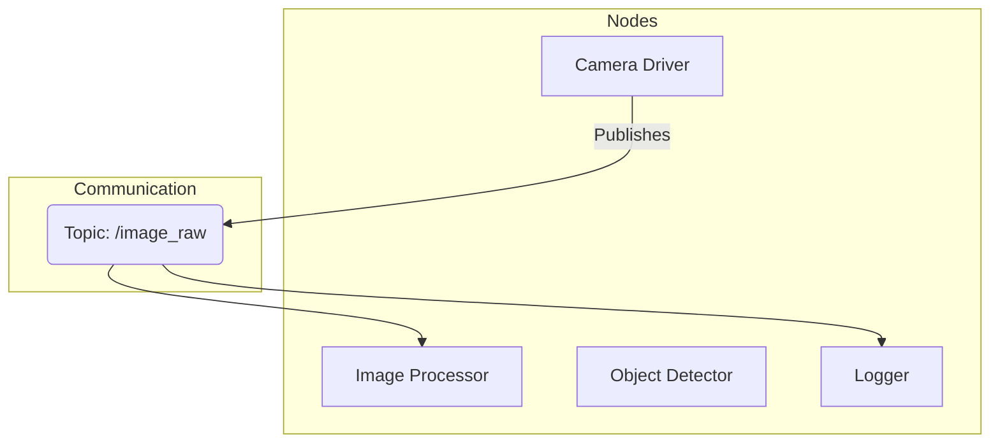
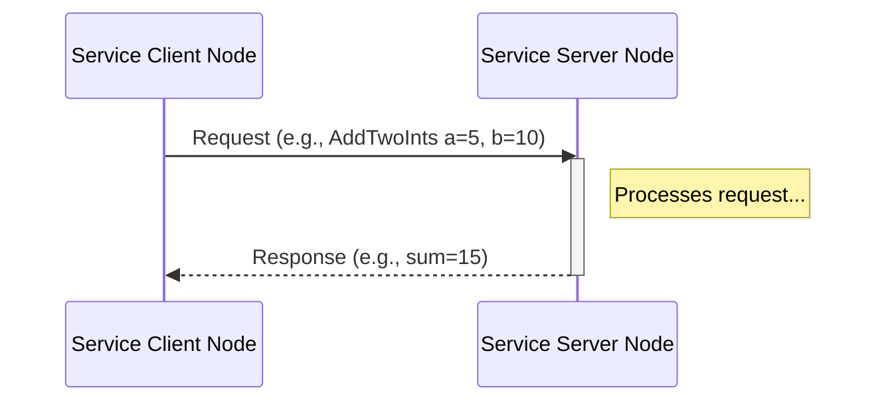

<!--
rag_chunk_id: module1_overview
rag_chunk_title: Module 1 Overview
rag_keywords: [ROS 2, introduction, overview, robotics, software framework]
-->
# Module 1: The Robotic Nervous System (ROS 2)

## Overview

Welcome to the first module of our journey into Physical AI and Humanoid Robotics. This module introduces the Robot Operating System (ROS 2), the foundational software framework that acts as the nervous system for a vast majority of modern robotic systems. ROS 2 provides a standardized architecture and a rich set of tools for managing the complex communication and data flow required to bring a robot to life.

In this section, we will explore the core principles of ROS 2, understanding how its distributed nature allows for modular and scalable robot software development. We will demystify how different parts of a robot's software, from low-level sensor drivers to high-level planning algorithms, can communicate with each other seamlessly. By the end of this module, you will have a solid grasp of the fundamental building blocks of ROS 2, preparing you to build and simulate your first robotic applications.

<!--
rag_chunk_id: module1_learning_objectives
rag_chunk_title: Learning Objectives
rag_keywords: [learning objectives, skills, goals, ROS 2 concepts]
-->
## Learning Objectives

By the end of this module, you will be able to:
- **Explain** the role of ROS 2 in a robotic system.
- **Describe** the core concepts: Nodes, Topics, Services, and Messages.
- **Understand** the purpose of URDF for robot modeling.
- **Write** a basic ROS 2 node in Python using `rclpy`.
- **Implement** publisher and subscriber nodes to communicate via topics.
- **Use** ROS 2 command-line tools to inspect and debug a running system.

<!--
rag_chunk_id: module1_prerequisites
rag_chunk_title: Prerequisites
rag_keywords: [prerequisites, requirements, software, hardware, Python, Ubuntu]
-->
## Prerequisites

### Knowledge
-   **Basic Python Programming**: You should be comfortable with Python syntax, data types, functions, and classes.
-   **Command-Line Basics**: Familiarity with navigating directories and running commands in a terminal (Linux shell) is essential.
-   **Object-Oriented Programming (OOP) Concepts**: A basic understanding of OOP principles will be beneficial.

### Software
-   **Ubuntu 22.04 LTS**: ROS 2 Humble Hawksbill (the version we will use) is primarily supported on this version of Ubuntu.
-   **ROS 2 Humble Hawksbill**: Installation instructions will be provided.
-   **Visual Studio Code**: Recommended text editor for Python development.

### Hardware
-   A computer capable of running Ubuntu 22.04, either natively or in a virtual machine (with at least 4GB of RAM and 2 CPU cores allocated).
-   No specialized robotics hardware is required for this module.

<!--
rag_chunk_id: module1_key_concepts
rag_chunk_title: Key Concepts
rag_keywords: [key concepts, core concepts, ROS 2]
-->
## Key Concepts

<!--
rag_chunk_id: module1_nodes
rag_chunk_title: ROS 2 Nodes
rag_keywords: [ROS 2, node, process, executable, modularity]
-->
### ROS 2 Nodes

A **Node** is the primary building block of a ROS 2 system. Think of a node as a single, executable process responsible for a specific task. For example, you might have one node for controlling a robot's wheel motors, another for reading data from a laser scanner, and a third for planning a path. Each node is a self-contained unit that can be developed, tested, and run independently. This modularity is a cornerstone of ROS 2's power and flexibility.

<!--
rag_chunk_id: module1_topics
rag_chunk_title: ROS 2 Topics
rag_keywords: [ROS 2, topics, communication, publisher, subscriber, messages]
-->
### ROS 2 Topics

**Topics** are the buses that nodes use to exchange data. They are named channels over which nodes can publish messages (send data) or subscribe to messages (receive data). This publish/subscribe mechanism is asynchronous and decouples data producers from data consumers. For instance, a camera driver node might publish raw image data to an `/image_raw` topic, and a separate image processing node can subscribe to this topic to receive and process the images without either node needing to know about the other's existence.

<!--
rag_chunk_id: module1_services
rag_chunk_title: ROS 2 Services
rag_keywords: [ROS 2, services, request, response, synchronous, client, server]
-->
### ROS 2 Services

While Topics are for continuous data streams, **Services** are used for synchronous, request/response interactions. A service consists of a pair of messages: a request and a response. One node (the client) sends a request message to another node (the server) and waits for a response. This is useful for tasks that require a confirmation or a computed result, such as triggering a specific action (e.g., "capture image") or querying the state of a node (e.g., "get current position").

<!--
rag_chunk_id: module1_urdf
rag_chunk_title: Unified Robot Description Format (URDF)
rag_keywords: [ROS 2, URDF, robot model, description, links, joints, XML]
-->
### Unified Robot Description Format (URDF)

The **Unified Robot Description Format (URDF)** is an XML format used to describe all physical aspects of a robot.
This includes:
- **Links**: The rigid parts of the robot (e.g., a forearm, a wheel).
- **Joints**: The connections between links, defining how they can move relative to each other (e.g., revolute, prismatic).
- **Visuals**: The 3D shape and appearance of each link.
- **Collision**: The geometry of each link used for collision detection in a physics simulator.

A URDF file allows simulation environments like Gazebo and visualization tools like RViz2 to understand and render the robot's structure and state.

<!--
rag_chunk_id: module1_rclpy
rag_chunk_title: ROS 2 Client Library for Python (rclpy)
rag_keywords: [ROS 2, rclpy, Python, client library, API]
-->
### ROS 2 Client Library for Python (rclpy)

`rclpy` is the official Python client library for interfacing with ROS 2. It provides the essential tools to create nodes, publish and subscribe to topics, and implement services and clients—all from within a Python script. Its user-friendly API makes it an excellent choice for rapid prototyping and developing high-level robotic logic, which we will use extensively throughout this book.

<!--
rag_chunk_id: module1_connection_to_ai
rag_chunk_title: Connection to Physical AI and Humanoid Robotics
rag_keywords: [Physical AI, humanoid robotics, perception, control, cognitive architecture]
-->
## Connection to Physical AI and Humanoid Robotics

Physical AI is the embodiment of artificial intelligence in a system that can perceive, reason about, and interact with the physical world. Humanoid robots are a quintessential example of Physical AI, requiring a complex interplay of sensors, actuators, and intelligent decision-making.

ROS 2 serves as the critical backbone for these systems by providing a structured communication layer:

-   **Sensing and Perception**: A humanoid robot is equipped with numerous sensors (cameras, IMUs, LiDAR, force sensors). Each sensor's data is published over a ROS 2 topic. This allows perception algorithms (e.g., for object detection or SLAM) to subscribe to this data, process it, and in turn, publish their results—such as the location of objects or a map of the environment—for other parts of the system to use.
-   **Motor Control and Actuation**: The complex network of joints and motors in a humanoid robot is controlled by ROS 2 nodes. High-level commands like "walk forward" or "grasp the object" are translated into low-level joint torque or position commands that are sent to the a motor controller nodes via topics or services.
-   **Cognitive Architecture**: The "brain" of the robot, where AI models for decision-making, planning, and language understanding reside, is itself a set of ROS 2 nodes. These nodes subscribe to perception data and publish high-level action commands, effectively bridging the gap between thought and physical action.

Without a framework like ROS 2, developers would need to create a custom, low-level messaging system from scratch, a monumental task that would divert focus from building the intelligence and capabilities of the robot itself. ROS 2 provides the standardized, modular, and scalable architecture necessary to orchestrate the immense complexity of a modern humanoid robot.

<!--
rag_chunk_id: module1_lab
rag_chunk_title: Step-by-Step Lab: Your First ROS 2 Package
rag_keywords: [lab, tutorial, workspace, package, colcon, build, source]
-->
## Step-by-Step Lab: Your First ROS 2 Package

This lab will guide you through creating a ROS 2 workspace and building a simple Python-based package.

### Step 1: Create a Workspace
A ROS 2 workspace is a directory where you will create and manage your ROS 2 packages.

First, create a directory for your workspace and a `src` subdirectory inside it.
```bash
mkdir -p ros2_ws/src
cd ros2_ws
```

### Step 2: Create a Python Package
Now, from inside the `ros2_ws/src` directory, use the ROS 2 command-line tool to create a new package. We'll name it `my_first_package`.

```bash
cd src
ros2 pkg create --build-type ament_python my_first_package
```

This command creates a new directory `my_first_package` with the following standard structure for a Python package:
```
my_first_package/
    my_first_package/
        __init__.py
    resource/
        my_first_package
    test/
        test_copyright.py
        test_flake8.py
        test_pep257.py
    package.xml
    setup.py
```

- **`package.xml`**: Contains metadata about the package.
- **`setup.py`**: Contains build information for the package.
- **`my_first_package/`**: The directory where your Python modules will live.

### Step 3: Build the Package
Navigate back to the root of your workspace (`ros2_ws`) and build the package using `colcon`. `colcon` is the standard build tool for ROS 2.

```bash
cd ..
colcon build
```

After a successful build, you will see new directories in your workspace: `build`, `install`, and `log`. The `install` directory contains the setup files that you need to source to make your new package available in the environment.

### Step 4: Source the Environment
Before you can use your new package, you need to add its location to your ROS 2 environment. You do this by "sourcing" the setup file in the `install` directory.

```bash
source install/setup.bash
```
Now, ROS 2 will be able to find and execute the nodes within your package. You have successfully created and built your first ROS 2 package!

<!--
rag_chunk_id: module1_publisher_node
rag_chunk_title: Lab - Create a Publisher Node
rag_keywords: [lab, publisher, node, rclpy, create_publisher, timer, colcon, ros2 run]
-->
### Step 5: Create a Publisher Node
Now let's create a node that publishes a simple "Hello, World!" message.

Inside your `my_first_package/my_first_package` directory, create a new file named `publisher_node.py` and add the following code:

```python
import rclpy
from rclpy.node import Node
from std_msgs.msg import String

class HelloWorldPublisher(Node):

    def __init__(self):
        super().__init__('hello_world_publisher')
        self.publisher_ = self.create_publisher(String, 'hello_world', 10)
        timer_period = 0.5  # seconds
        self.timer = self.create_timer(timer_period, self.timer_callback)
        self.i = 0

    def timer_callback(self):
        msg = String()
        msg.data = 'Hello World: %d' % self.i
        self.publisher_.publish(msg)
        self.get_logger().info('Publishing: "%s"' % msg.data)
        self.i += 1

def main(args=None):
    rclpy.init(args=args)
    hello_world_publisher = HelloWorldPublisher()
    rclpy.spin(hello_world_publisher)
    hello_world_publisher.destroy_node()
    rclpy.shutdown()

if __name__ == '__main__':
    main()
```

**Code Explained:**
1. We import the necessary libraries: `rclpy`, `Node`, and the `String` message type.
2. Our `HelloWorldPublisher` class inherits from `Node`.
3. In the constructor, we create a publisher using `create_publisher`. It publishes messages of type `String` on the `hello_world` topic.
4. A timer is created to call the `timer_callback` function every 0.5 seconds.
5. The `timer_callback` function creates a `String` message, publishes it, and logs it to the console.

Now, we need to tell ROS 2 how to run this node. Open the `setup.py` file in your `my_first_package` directory and add the `entry_points` argument to the `setup` function:

```python
# Inside setup.py

setup(
    # ... other settings
    entry_points={
        'console_scripts': [
            'hello_publisher = my_first_package.publisher_node:main',
        ],
    },
)
```
*Make sure to add the comma after the existing arguments!* This tells `colcon` to create an executable script named `hello_publisher` that runs the `main` function from your `publisher_node.py` file.

Rebuild your package from the workspace root (`ros2_ws`):
```bash
colcon build
source install/setup.bash
```

Now you can run your publisher node:
```bash
ros2 run my_first_package hello_publisher
```
You should see the "Publishing: ..." message printed in your terminal. In another terminal, you can inspect the topic:
```bash
ros2 topic echo /hello_world
```
You will see the messages being published by your node.

<!--
rag_chunk_id: module1_subscriber_node
rag_chunk_title: Lab - Create a Subscriber Node
rag_keywords: [lab, subscriber, node, rclpy, create_subscription, callback]
-->
### Step 6: Create a Subscriber Node
A subscriber node listens to a topic and processes the messages it receives. Let's create one to listen to our `hello_world` topic.

Inside `my_first_package/my_first_package`, create a new file named `subscriber_node.py` with this content:

```python
import rclpy
from rclpy.node import Node
from std_msgs.msg import String

class HelloWorldSubscriber(Node):

    def __init__(self):
        super().__init__('hello_world_subscriber')
        self.subscription = self.create_subscription(
            String,
            'hello_world',
            self.listener_callback,
            10)
        self.subscription  # prevent unused variable warning

    def listener_callback(self, msg):
        self.get_logger().info('I heard: "%s"' % msg.data)

def main(args=None):
    rclpy.init(args=args)
    hello_world_subscriber = HelloWorldSubscriber()
    rclpy.spin(hello_world_subscriber)
    hello_world_subscriber.destroy_node()
    rclpy.shutdown()

if __name__ == '__main__':
    main()
```
**Code Explained:**
1. This code is very similar to the publisher.
2. In the constructor, we use `create_subscription` to subscribe to the `hello_world` topic.
3. We specify the message type (`String`), the topic name (`hello_world`), and the callback function (`self.listener_callback`) to be executed whenever a message is received.

Now, update `setup.py` again to add an entry point for this new node:
```python
# Inside setup.py

'console_scripts': [
    'hello_publisher = my_first_package.publisher_node:main',
    'hello_subscriber = my_first_package.subscriber_node:main',
],
```

Rebuild, source, and run. You will need two terminals.
In terminal 1, run the publisher:
```bash
ros2 run my_first_package hello_publisher
```
In terminal 2, run the subscriber:
```bash
ros2 run my_first_package hello_subscriber
```
You will see the subscriber's terminal printing the "I heard: ..." messages that the publisher is sending. You have just created a complete communication system!

<!--
rag_chunk_id: module1_service_creation
rag_chunk_title: Lab - Create a Service
rag_keywords: [lab, service, client, server, srv, rosidl, colcon]
-->
### Step 7: Create a Service
Finally, let's create a service. A service allows one node to request a result from another. We'll create a service that adds two integers.

<!--
rag_chunk_id: module1_service_definition
rag_chunk_title: Lab - Define the Service (.srv) file
rag_keywords: [lab, service, srv file, definition, request, response]
-->
#### Part A: Define the Service (`.srv` file)
First, we need to define the service's request and response structure. In your package, create a new directory called `srv`. Inside `my_first_package/srv`, create a file named `AddTwoInts.srv`:

```
int64 a
int64 b
---
int64 sum
```
- The part above the `---` is the request: two 64-bit integers, `a` and `b`.
- The part below is the response: one 64-bit integer, `sum`.

<!--
rag_chunk_id: module1_service_build_files
rag_chunk_title: Lab - Update Build Files for Service
rag_keywords: [lab, service, package.xml, CMakeLists.txt, rosidl, ament]
-->
#### Part B: Update Build Files
You need to tell ROS 2 to build this service definition. 
First, open `package.xml` and add these lines to ensure the necessary dependencies are met:
```xml
<build_depend>rosidl_default_generators</build_depend>
<exec_depend>rosidl_default_runtime</exec_depend>
<member_of_group>rosidl_interface_packages</member_of_group>
```
Next, open `CMakeLists.txt` (you'll need to create this file in your package root if it doesn't exist, as `ament_python` doesn't create it by default) and add:
```cmake
cmake_minimum_required(VERSION 3.8)
project(my_first_package)

find_package(ament_cmake REQUIRED)
find_package(rosidl_default_generators REQUIRED)

rosidl_generate_interfaces(${PROJECT_NAME}
  "srv/AddTwoInts.srv"
)

ament_package()
```
*Note: Using custom service/message definitions requires a `CMakeLists.txt` even for a Python package.*

<!--
rag_chunk_id: module1_service_server
rag_chunk_title: Lab - Create the Service Server
rag_keywords: [lab, service, server, rclpy, create_service, callback]
-->
#### Part C: Create the Service Server Node
Now, create a file named `add_two_ints_server.py` in `my_first_package/my_first_package/`:
```python
from my_first_package.srv import AddTwoInts
import rclpy
from rclpy.node import Node

class AddTwoIntsServer(Node):

    def __init__(self):
        super().__init__('add_two_ints_server')
        self.srv = self.create_service(AddTwoInts, 'add_two_ints', self.add_two_ints_callback)

    def add_two_ints_callback(self, request, response):
        response.sum = request.a + request.b
        self.get_logger().info('Incoming request\na: %d b: %d' % (request.a, request.b))
        self.get_logger().info('Sending back response: [%d]' % (response.sum))
        return response

def main(args=None):
    rclpy.init(args=args)
    add_two_ints_server = AddTwoIntsServer()
    rclpy.spin(add_two_ints_server)
    add_two_ints_server.destroy_node()
    rclpy.shutdown()

if __name__ == '__main__':
    main()
```

<!--
rag_chunk_id: module1_service_client
rag_chunk_title: Lab - Create the Service Client
rag_keywords: [lab, service, client, rclpy, create_client, async, future]
-->
#### Part D: Create the Service Client Node
Create another file, `add_two_ints_client.py`, in `my_first_package/my_first_package/`:
```python
import sys
from my_first_package.srv import AddTwoInts
import rclpy
from rclpy.node import Node

class AddTwoIntsClient(Node):

    def __init__(self):
        super().__init__('add_two_ints_client')
        self.cli = self.create_client(AddTwoInts, 'add_two_ints')
        while not self.cli.wait_for_service(timeout_sec=1.0):
            self.get_logger().info('service not available, waiting again...')
        self.req = AddTwoInts.Request()

    def send_request(self, a, b):
        self.req.a = a
        self.req.b = b
        self.future = self.cli.call_async(self.req)
        rclpy.spin_until_future_complete(self, self.future)
        return self.future.result()

def main(args=None):
    rclpy.init(args=args)

    add_two_ints_client = AddTwoIntsClient()
    if len(sys.argv) != 3:
        add_two_ints_client.get_logger().info('Usage: ros2 run my_first_package add_two_ints_client <int> <int>')
        return

    response = add_two_ints_client.send_request(int(sys.argv[1]), int(sys.argv[2]))
    add_two_ints_client.get_logger().info(
        'Result of add_two_ints: for %d + %d = %d' %
        (int(sys.argv[1]), int(sys.argv[2]), response.sum))

    add_two_ints_client.destroy_node()
    rclpy.shutdown()

if __name__ == '__main__':
    main()
```

<!--
rag_chunk_id: module1_service_build_run
rag_chunk_title: Lab - Build and Run the Service
rag_keywords: [lab, service, setup.py, colcon, build, ros2 run]
-->
#### Part E: Update setup.py and Build
Finally, update `setup.py` with the new entry points:
```python
# Inside setup.py
'console_scripts': [
    'hello_publisher = my_first_package.publisher_node:main',
    'hello_subscriber = my_first_package.subscriber_node:main',
    'add_two_ints_server = my_first_package.add_two_ints_server:main',
    'add_two_ints_client = my_first_package.add_two_ints_client:main',
],
```

Now, build the workspace from the root (`ros2_ws`). This build is more complex as it involves generating code from the `.srv` file.
```bash
colcon build
source install/setup.bash
```

<!--
rag_chunk_id: module1_service_run
rag_chunk_title: Lab - Run the Service
rag_keywords: [lab, service, run, ros2 run]
-->
#### Part F: Run the Service
In one terminal, run the server:
```bash
ros2 run my_first_package add_two_ints_server
```
In a second terminal, run the client with two numbers as arguments:
```bash
ros2 run my_first_package add_two_ints_client 41 1
```
The client will send the request, the server will process it and log the action, and the client will then print the result.

<!--
rag_chunk_id: module1_simulation_context
rag_chunk_title: ROS 2 in a Simulated Environment
rag_keywords: [simulation, Gazebo, Isaac Sim, hardware abstraction, virtual environment]
-->
## ROS 2 in a Simulated Environment

The nodes, topics, and services we have created are the fundamental building blocks for controlling a robot, whether it's a physical piece of hardware or a simulated one in a virtual environment like Gazebo. The power of ROS 2 lies in its hardware abstraction; the nodes we just wrote would not need to change significantly to work with a simulation.

Here’s how it fits together:

1.  **Simulation as a Node**: A physics simulator like Gazebo or NVIDIA Isaac Sim runs as one or more ROS 2 nodes. These nodes are responsible for simulating the robot's physics, generating sensor data, and accepting commands to move the robot's joints.

2.  **Simulated Sensors**: Instead of a physical camera driver, a simulation "camera plugin" would publish images to the `/image_raw` topic. Your image processing node would subscribe to this topic and would not know or care whether the data is from a real camera or a simulated one.

3.  **Simulated Actuators**: To make a simulated robot move, a "motor controller plugin" would subscribe to topics that carry velocity or position commands. Your high-level navigation node would publish to these topics, just as it would with a physical robot.

4.  **Testing without Hardware**: This setup is incredibly powerful for development. You can write and test complex AI and control logic on a simulated robot on your computer without needing access to the final, expensive hardware. You can simulate scenarios that might be dangerous or difficult to replicate in the real world.

In **Module 2**, we will dive deep into setting up and using a simulation environment. We will take the concepts from this module and apply them to a simulated robot, making it perceive and interact with its virtual world. The nodes we built here could be the first "brain cells" of our simulated humanoid robot.

## Suggested Diagrams

### 1. Basic Publisher-Subscriber Flow

This diagram shows a simple flow where a publisher node sends data to a subscriber node via a topic.



### 2. Multiple Nodes and a Single Topic

This illustrates how multiple nodes can publish and subscribe to the same topic.



### 3. Service Client-Server Interaction

This shows the request/response pattern of a ROS 2 service.



## FAQs and Troubleshooting

Here are some common questions and issues you might encounter while working through this module.

**Q: I ran `colcon build` but my new node executable isn't found when I try `ros2 run`.**
**A:** There are two common reasons for this:
1.  **You forgot to source the environment.** After every `colcon build`, you must source the workspace's setup files. In your workspace root (`ros2_ws`), run `source install/setup.bash`.
2.  **You forgot to add the entry point.** Make sure you added the executable to the `console_scripts` list in your `setup.py` file and that the syntax is correct. A missing comma is a frequent error.

**Q: My publisher is running, but my subscriber doesn't receive any messages.**
**A:** Check the following:
1.  **Topic Names:** Are both the publisher and subscriber using the *exact* same topic name? A small typo can cause this. Use `ros2 topic list` to see the active topics.
2.  **QoS Settings:** For now, we are using default Quality of Service (QoS) settings. In more advanced scenarios, incompatible QoS settings between a publisher and subscriber can prevent them from connecting.
3.  **Network Issues:** If you are running nodes on different machines (or in different Docker containers), ensure they can communicate over the network.

**Q: My service client says "service not available, waiting again...".**
**A:** This means the client cannot find the service server on the network.
1.  **Is the server running?** Make sure you started the service server node in a separate terminal.
2.  **Correct Service Name:** Double-check that the service name used in the client (`create_client`) and the service (`create_service`) are identical. Use `ros2 service list` to see all available services.

**Q: Can a node be both a publisher and a subscriber?**
**A:** Absolutely! A single node can create any number of publishers, subscribers, services, and clients. This is very common. For example, a node might subscribe to raw sensor data, process it, and then publish the results on a different topic.

## References and Resources

For more in-depth information, please refer to the official ROS 2 documentation.

-   **ROS 2 Documentation Main Page**: [https://docs.ros.org/en/humble/index.html](https://docs.ros.org/en/humble/index.html)
-   **Tutorial: Creating Your First Package**: [https://docs.ros.org/en/humble/Tutorials/Beginner-Client-Libraries/Creating-Your-First-ROS2-Package.html](https://docs.ros.org/en/humble/Tutorials/Beginner-Client-Libraries/Creating-Your-First-ROS2-Package.html)
-   **Tutorial: Writing a simple publisher and subscriber (Python)**: [https://docs.ros.org/en/humble/Tutorials/Beginner-Client-Libraries/Writing-A-Simple-Py-Publisher-And-Subscriber.html](https://docs.ros.org/en/humble/Tutorials/Beginner-Client-Libraries/Writing-A-Simple-Py-Publisher-And-Subscriber.html)
-   **Tutorial: Writing a simple service and client (Python)**: [https://docs.ros.org/en/humble/Tutorials/Beginner-Client-Libraries/Writing-A-Simple-Py-Service-And-Client.html](https://docs.ros.org/en/humble/Tutorials/Beginner-Client-Libraries/Writing-A-Simple-Py-Service-And-Client.html)
-   **Understanding Quality of Service (QoS)**: [https://docs.ros.org/en/humble/Concepts/Intermediate/About-Quality-of-Service.html](https://docs.ros.org/en/humble/Concepts/Intermediate/About-Quality-of-Service.html)
