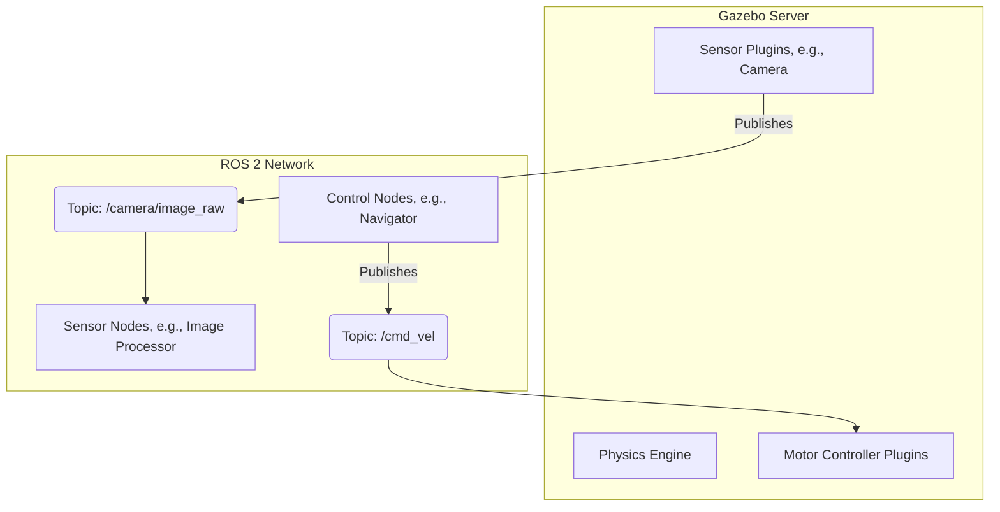
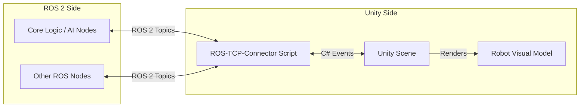

<!--
rag_chunk_id: module2_overview
rag_chunk_title: Module 2 Overview
rag_keywords: [Gazebo, Unity, simulation, digital twin, physics simulation, sensor simulation]
-->
# Module 2: The Digital Twin (Gazebo & Unity)

## Overview

Welcome to Module 2, where we bring our robot from the realm of pure logic into a simulated physical world. A **Digital Twin** is a virtual representation of a physical object or system. In robotics, this means creating a simulated version of our robot and its environment that is so accurate it can be used for development, testing, and training as if it were the real thing.

This module explores the core technologies behind creating these digital twins, focusing on two powerful and widely-used simulation platforms: **Gazebo** and **Unity**. We will learn how to build virtual worlds, import our robot models (like the URDFs mentioned in Module 1), and simulate the physics and sensor data that are critical for developing intelligent robotic behaviors.

<!--
rag_chunk_id: module2_learning_objectives
rag_chunk_title: Learning Objectives
rag_keywords: [learning objectives, skills, goals, Gazebo, Unity, URDF, ROS 2]
-->
## Learning Objectives

By the end of this module, you will be able to:
- **Explain** the concept of a Digital Twin and its importance in robotics.
- **Describe** the roles of a physics engine and sensor simulation.
- **Create** a simple virtual environment (a "world") in Gazebo.
- **Spawn** a URDF robot model into a Gazebo simulation.
- **Integrate** a Gazebo simulation with ROS 2 to read sensor data and control a robot.
- **Understand** the key differences between Gazebo and Unity for robotics simulation.

<!--
rag_chunk_id: module2_prerequisites
rag_chunk_title: Prerequisites
rag_keywords: [prerequisites, requirements, software, hardware, ROS 2, Gazebo]
-->
## Prerequisites

### Knowledge
-   **Completion of Module 1**: You must be comfortable with all the key concepts of ROS 2, including nodes, topics, services, and packages.
-   **Understanding of URDF**: You should understand the basic structure of a URDF file for describing a robot model.

### Software
-   **ROS 2 Humble and Gazebo**: Gazebo is installed by default with the `ros-humble-desktop` installation of ROS 2.
-   **Colcon**: The ROS 2 build tool, which should already be installed.

### Hardware
- **A computer with a dedicated GPU (recommended)**: While not strictly required, running 3D simulations is graphically intensive. A dedicated NVIDIA or AMD graphics card will result in a much smoother experience than integrated graphics.

<!--
rag_chunk_id: module2_lab_intro
rag_chunk_title: Lab Introduction
rag_keywords: [lab, tutorial, Gazebo, simulation, robot]
-->
## Step-by-Step Lab: Your First Simulation

This lab will guide you through the basics of creating a world in Gazebo and spawning a simple robot.

<!--
rag_chunk_id: module2_lab_launch_gazebo
rag_chunk_title: Lab - Launch Gazebo
rag_keywords: [lab, Gazebo, launch, command line]
-->
### Step 1: Launch Gazebo
Gazebo is integrated with ROS 2 and can be launched directly from the command line. Open a terminal and run:

```bash
gazebo
```

A new window should open, showing an empty, gray world with a grid. You can navigate the world:
- **Left-click and drag**: Pan the camera.
- **Middle-click (or scroll wheel click) and drag**: Zoom the camera.
- **Right-click and drag**: Orbit the camera.

<!--
rag_chunk_id: module2_lab_create_world
rag_chunk_title: Lab - Create a World File
rag_keywords: [lab, Gazebo, world file, SDF, XML, environment]
-->
### Step 2: Create a Simple World File
A "world" in Gazebo is defined in a file using the SDF (Simulation Description Format). It's an XML format that describes everything in the simulation: the environment, lighting, physics, and the robots themselves.

Create a new directory for our Gazebo-related files. In your `ros2_ws/src` directory, create a new package to hold our simulation files.
```bash
cd ~/ros2_ws/src
ros2 pkg create --build-type ament_python my_simulation_pkg
```
Inside this new package, create a directory named `worlds`.
```bash
cd my_simulation_pkg
mkdir worlds
```
Now, inside the `worlds` directory, create a file named `simple.world` and add the following content:

```xml
<?xml version="1.0" ?>
<sdf version="1.7">
  <world name="default">
    <!-- A global light source -->
    <include>
      <uri>model://sun</uri>
    </include>
    <!-- A ground plane -->
    <include>
      <uri>model://ground_plane</uri>
    </include>
    <!-- A simple wooden box -->
    <model name="box">
      <pose>2 0 0.5</pose>
      <link name="link">
        <collision name="collision">
          <geometry>
            <box>
              <size>1 1 1</size>
            </box>
          </geometry>
        </collision>
        <visual name="visual">
          <geometry>
            <box>
              <size>1 1 1</size>
            </box>
          </geometry>
        </visual>
      </link>
    </model>
  </world>
</sdf>
```
**World File Explained:**
- We include two pre-defined models from Gazebo's model library: a `sun` for lighting and a `ground_plane`.
- We define a new model named `box`, give it a position (`pose`), and define its collision and visual properties as a 1x1x1 meter cube.

<!--
rag_chunk_id: module2_lab_launch_world
rag_chunk_title: Lab - Launch Your World
rag_keywords: [lab, Gazebo, launch, world file, colcon, ros2]
-->
### Step 3: Launch Your World
You can now launch Gazebo with your custom world file. Make sure you are in your workspace root (`~/ros2_ws`).

```bash
# First, build your new package so ROS 2 can find it
colcon build --packages-select my_simulation_pkg
source install/setup.bash

# Now launch Gazebo with the world file
gazebo --verbose src/my_simulation_pkg/worlds/simple.world
```

Gazebo should now launch and display a world with a ground plane and a single wooden box. You have successfully created and launched a custom simulation environment!

<!--
rag_chunk_id: module2_lab_spawn_robot
rag_chunk_title: Lab - Spawning a Robot
rag_keywords: [lab, Gazebo, spawn, robot, URDF, ros2 run]
-->
### Step 4: Spawning a Robot
Now that we have a world, let's add a robot to it. We will create a very simple robot model as a URDF file.

First, create a `urdf` directory inside your `my_simulation_pkg`.
```bash
cd ~/ros2_ws/src/my_simulation_pkg
mkdir urdf
```
Inside the `urdf` directory, create a file named `simple_robot.urdf` with this content:

```xml
<?xml version="1.0"?>
<robot name="simple_robot">
  <link name="base_link">
    <visual>
      <geometry>
        <cylinder length="0.6" radius="0.2"/>
      </geometry>
    </visual>
    <collision>
      <geometry>
        <cylinder length="0.6" radius="0.2"/>
      </geometry>
    </collision>
  </link>
</robot>
```
This defines a robot with a single link, `base_link`, which is represented by a cylinder.

To spawn this robot into our Gazebo world, we can use a ROS 2 command. This requires two terminals.

**In Terminal 1**, launch the world we created previously:
```bash
# Make sure you are in your workspace root (e.g., ~/ros2_ws)
source install/setup.bash
gazebo --verbose src/my_simulation_pkg/worlds/simple.world
```

**In Terminal 2**, use the `ros2 run` command to call the `spawn_entity.py` script, which is a utility provided by Gazebo's ROS integration.
```bash
# Make sure you are in your workspace root (e.g., ~/ros2_ws)
source install/setup.bash
ros2 run gazebo_ros spawn_entity.py -entity simple_robot -file src/my_simulation_pkg/urdf/simple_robot.urdf
```

Look at your Gazebo window. A cylinder representing our simple robot should now appear at the origin (0,0,0) of the world. You have successfully spawned a robot model into Gazebo!

<!--
rag_chunk_id: module2_lab_add_sensor
rag_chunk_title: Lab - Adding a Sensor to the Robot
rag_keywords: [lab, Gazebo, sensor, camera, URDF, plugin, rviz2]
-->
### Step 5: Adding a Sensor to the Robot
A robot is not very useful without sensors. Let's add a camera to our robot. This involves modifying the URDF file to include the sensor and its Gazebo plugin.

First, let's create a new URDF file called `sensor_robot.urdf` in the `urdf` directory. This will be a copy of `simple_robot.urdf` but with a camera sensor added.

```xml
<?xml version="1.0"?>
<robot name="sensor_robot">
  <link name="base_link">
    <visual>
      <geometry>
        <cylinder length="0.6" radius="0.2"/>
      </geometry>
    </visual>
    <collision>
      <geometry>
        <cylinder length="0.6" radius="0.2"/>
      </geometry>
    </collision>
  </link>

  <link name="camera_link">
    <visual>
      <geometry>
        <box size="0.05 0.05 0.05"/>
      </geometry>
      <material name="red"/>
    </visual>
  </link>

  <joint name="camera_joint" type="fixed">
    <parent link="base_link"/>
    <child link="camera_link"/>
    <origin xyz="0.2 0 0.3" rpy="0 0 0"/>
  </joint>

  <gazebo reference="camera_link">
    <sensor type="camera" name="camera_sensor">
      <update_rate>30.0</update_rate>
      <camera name="head">
        <horizontal_fov>1.3962634</horizontal_fov>
        <image>
          <width>800</width>
          <height>800</height>
          <format>R8G8B8</format>
        </image>
        <clip>
          <near>0.02</near>
          <far>300</far>
        </clip>
      </camera>
      <plugin name="camera_controller" filename="libgazebo_ros_camera.so">
        <ros>
          <namespace>/demo</namespace>
          <remapping>image_raw:=image_demo</remapping>
        </ros>
      </plugin>
    </sensor>
  </gazebo>
</robot>
```

**URDF Changes Explained:**
1.  We added a new `link` named `camera_link`.
2.  We added a `joint` to connect `camera_link` to `base_link`.
3.  The `<gazebo>` tag is the most important part. It tells Gazebo to attach a camera sensor to the `camera_link`.
4.  The `<plugin>` tag loads the `libgazebo_ros_camera.so` plugin, which is responsible for publishing the camera's images to a ROS 2 topic. We have remapped the topic to `/demo/image_demo`.

Now, let's see this in action. We need three terminals.

**In Terminal 1**, launch the world:
```bash
gazebo --verbose src/my_simulation_pkg/worlds/simple.world
```

**In Terminal 2**, spawn the new `sensor_robot` model:
```bash
ros2 run gazebo_ros spawn_entity.py -entity sensor_robot -file src/my_simulation_pkg/urdf/sensor_robot.urdf
```

**In Terminal 3**, launch RViz2, the standard ROS 2 visualization tool.
```bash
rviz2
```
In RViz2, click the "Add" button in the bottom-left, then select "By topic", and then choose `/demo/image_demo`. Click "Ok". You should now see the view from your robot's simulated camera in RViz2! You can place objects (like the wooden box) in front of the robot in Gazebo and see them appear in the RViz2 window.

<!--
rag_chunk_id: module2_unity_integration
rag_chunk_title: A Note on Unity Integration
rag_keywords: [Unity, integration, ROS, Unity Robotics Hub, HRI, graphics]
-->
## A Note on Unity Integration

While Gazebo is excellent for physics simulation and is deeply integrated with ROS, the Unity 3D engine offers a suite of tools that are exceptionally powerful for creating high-fidelity graphics and complex human-robot interaction (HRI) scenarios.

A full step-by-step lab for Unity is beyond the scope of this introductory module, but it is important to understand the workflow and how it complements a ROS-based system.

### How it Works: The ROS-Unity Connection
The integration between ROS 2 and Unity is typically achieved using the **Unity Robotics Hub**. This collection of packages allows for bidirectional communication between a ROS 2 system and a Unity scene.

The general workflow is as follows:
1.  **ROS Side**: The core robotics logic, physics simulation (if not done in Unity), and AI algorithms run as standard ROS 2 nodes.
2.  **Unity Side**: The Unity scene contains a 3D model of the robot and the environment. It focuses on rendering photorealistic visuals and managing complex interactions.
3.  **Communication**: A TCP connection is established between ROS 2 and Unity. Special scripts in Unity act as ROS 2 nodes, allowing them to subscribe to topics (e.g., to get joint states to update the robot's visual model) and publish topics (e.g., to send simulated camera data from a Unity camera).

### Key Advantages of Using Unity
- **Photorealistic Rendering**: Unity can produce stunning, lifelike images. This is invaluable for training and testing computer vision models that need to work in the real world.
- **Rich Asset Store**: The Unity Asset Store provides a massive library of 3D models, environments, and tools that can be used to rapidly create complex and realistic simulation scenarios.
- **Advanced HRI**: Unity's power as a game engine makes it ideal for creating sophisticated simulations involving virtual reality (VR), augmented reality (AR), and interactions with virtual humans.

For those interested in exploring this further, the official **Unity Robotics Hub** is the best place to start:
- **Unity Robotics Hub on GitHub**: [https://github.com/Unity-Technologies/Unity-Robotics-Hub](https://github.com/Unity-Technologies/Unity-Robotics-Hub)

## Suggested Diagrams

### 1. Gazebo and ROS 2 Integration

This diagram shows how Gazebo integrates with ROS 2. Gazebo runs as a server, and plugins within Gazebo publish and subscribe to ROS 2 topics.



### 2. Unity and ROS 2 Integration Architecture

This diagram illustrates the high-level architecture for connecting a Unity scene with a ROS 2 network via the Robotics Hub.


## FAQs and Troubleshooting

**Q: Gazebo is running very slowly or is choppy.**
**A:** 3D simulation is resource-intensive.
1.  **Use a Dedicated GPU**: This is the most common cause of poor performance. Integrated graphics cards struggle with 3D rendering.
2.  **Reduce World Complexity**: A world with many complex models will be slower. Try removing some objects to see if performance improves.
3.  **Disable Real Time Update**: In the Gazebo GUI, you can uncheck the "Real Time" option in the "Physics" tab. This will allow the simulation to run slower than real time if your computer cannot keep up.

**Q: I spawned my robot, but it's not in the world.**
**A:**
1.  **Check Gazebo's "World" tab**: In the Gazebo GUI, on the left-hand side, there is a "World" tab. Expand it and see if your robot's model name is listed. If it is, it might have spawned at an odd location.
2.  **Check for Errors**: Look at the output of the `spawn_entity.py` script. It might give you an error message if there is an issue with your URDF file.
3.  **Check URDF Syntax**: A small syntax error in your URDF can cause it to fail to load. You can use the `check_urdf` command to validate your URDF file: `check_urdf src/my_simulation_pkg/urdf/simple_robot.urdf`.

**Q: I can't see my camera feed in RViz2.**
**A:**
1.  **Check Topic Name**: Use `ros2 topic list` to see all available topics. Make sure the topic you are trying to visualize in RViz2 matches the one being published by the Gazebo plugin. Remember that we remapped it to `/demo/image_demo`.
2.  **Check Plugin**: Ensure the `<plugin>` tag in your URDF is correct and that the `libgazebo_ros_camera.so` library is found by Gazebo.
3.  **Fixed Frame**: In RViz2, make sure your "Fixed Frame" (in the "Global Options" panel) is set to a frame that exists. `base_link` is a good choice for this example.

## References and Resources

-   **Gazebo Classic Documentation**: [http://classic.gazebosim.org/tutorials](http://classic.gazebosim.org/tutorials)
-   **Gazebo ROS 2 Packages Documentation**: [https://github.com/ros-simulation/gazebo_ros_pkgs](https://github.com/ros-simulation/gazebo_ros_pkgs)
-   **SDF Format Specification**: [http://sdformat.org/spec](http://sdformat.org/spec)
-   **Unity Robotics Hub**: [https://github.com/Unity-Technologies/Unity-Robotics-Hub](https://github.com/Unity-Technologies/Unity-Robotics-Hub)