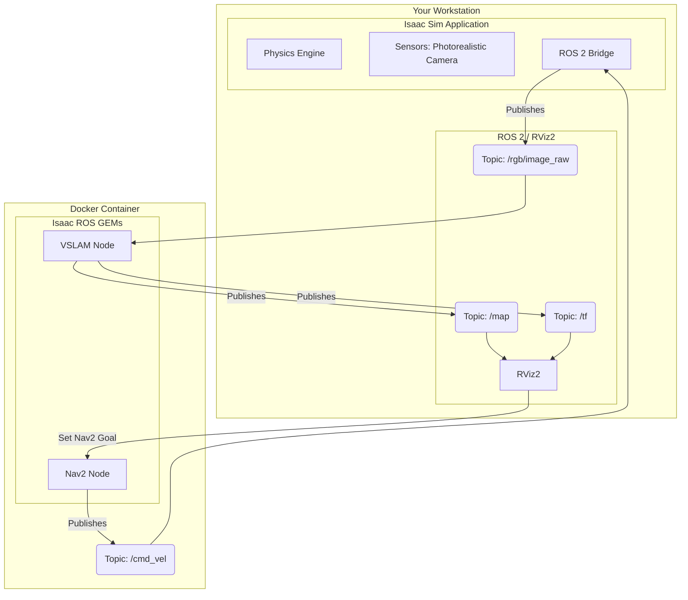

<!--
rag_chunk_id: module3_overview
rag_chunk_title: Module 3 Overview
rag_keywords: [NVIDIA Isaac, Isaac Sim, Isaac ROS, robotics, AI, simulation]
-->
# Module 3: The AI-Robot Brain (NVIDIA Isaac™)

## Overview

Welcome to Module 3, where we explore the powerful ecosystem provided by NVIDIA for building the "brains" of our robots. NVIDIA Isaac is a comprehensive platform designed to accelerate the development and deployment of AI-powered robots. It provides a suite of tools that leverage NVIDIA's expertise in GPU-accelerated computing, simulation, and AI.

In this module, we will focus on the core components of the Isaac platform, including **Isaac Sim** for high-fidelity, physics-accurate simulation, and **Isaac ROS**, a collection of hardware-accelerated packages for ROS 2. We will also introduce key AI concepts that are critical for autonomous robotics, such as Visual SLAM (VSLAM) for mapping, Nav2 for navigation, and Reinforcement Learning (RL) for teaching robots complex behaviors.

<!--
rag_chunk_id: module3_learning_objectives
rag_chunk_title: Learning Objectives
rag_keywords: [learning objectives, skills, goals, Isaac Sim, Isaac ROS, VSLAM, Nav2, RL]
-->
## Learning Objectives

By the end of this module, you will be able to:
- **Describe** the key components and advantages of the NVIDIA Isaac ecosystem.
- **Explain** the difference between Isaac Sim and Gazebo.
- **Understand** how Isaac ROS packages can accelerate perception tasks.
- **Define** VSLAM, Nav2, and Reinforcement Learning at a conceptual level.
- **Run** a simple Isaac Sim environment.
- **Launch** a hardware-accelerated ROS 2 node from an Isaac ROS package.

<!--
rag_chunk_id: module3_prerequisites
rag_chunk_title: Prerequisites
rag_keywords: [prerequisites, requirements, software, hardware, NVIDIA, Isaac Sim, Docker]
-->
## Prerequisites

### Knowledge
-   **Completion of Modules 1 and 2**: You should be comfortable with ROS 2 concepts and have experience with a simulator like Gazebo.
-   **Basic Understanding of AI**: Familiarity with the concepts of machine learning and deep learning is helpful, but not strictly required.

### Software
-   **NVIDIA Isaac Sim**: Installation requires the NVIDIA Omniverse Launcher.
-   **Docker**: Isaac ROS packages are distributed as Docker containers.
-   **NVIDIA Container Toolkit**: To enable GPU support within Docker.
-   **ROS 2 Humble**: To communicate with Isaac Sim and Isaac ROS containers.

### Hardware
-   **NVIDIA RTX Series GPU**: A powerful NVIDIA graphics card (RTX 20-series or later) is **required** to run Isaac Sim and the GPU-accelerated Isaac ROS packages. An RTX 3070 or higher is strongly recommended.
- **Sufficient RAM and Storage**: At least 32 GB of RAM and 100 GB of free disk space are recommended for Isaac Sim and its assets.

<!--
rag_chunk_id: module3_lab_intro
rag_chunk_title: Lab Introduction
rag_keywords: [lab, tutorial, Isaac Sim, NVIDIA]
-->
## Step-by-Step Lab: Exploring Isaac Sim

This lab provides a high-level guide to getting started with NVIDIA Isaac Sim. Given the complexity and rapid evolution of the platform, we will focus on the general workflow rather than a highly specific, command-by-command tutorial.

<!--
rag_chunk_id: module3_lab_launch_isaac
rag_chunk_title: Lab - Launch Isaac Sim
rag_keywords: [lab, Isaac Sim, launch, Omniverse Launcher]
-->
### Step 1: Launch Isaac Sim
Isaac Sim is installed and launched via the **NVIDIA Omniverse Launcher**.

1.  Open the Omniverse Launcher.
2.  Navigate to the "Exchange" tab and ensure you have Isaac Sim installed.
3.  Navigate to the "Library" tab, select "Isaac Sim", and click "Launch".

This will open the main Isaac Sim window.

<!--
rag_chunk_id: module3_lab_open_example
rag_chunk_title: Lab - Open an Example Environment
rag_keywords: [lab, Isaac Sim, example, environment, USD]
-->
### Step 2: Open an Example Environment
Isaac Sim comes with a rich library of pre-built environments and robots. The best way to get started is to explore one of these.

1.  From the top menu bar, go to `File > Open...`.
2.  Navigate to the directory where your Isaac Sim assets are stored. A common location for the example environments is `(your_isaac_sim_directory)/apps/isaac-sim/samples/Isaac/Environments/`.
3.  Select an environment file, such as `simple_room.usd`, and open it.

The viewport will now load the environment. You can navigate the scene using the same mouse controls as in many 3D applications (right-click to orbit, middle-click to pan, scroll to zoom).

<!--
rag_chunk_id: module3_lab_run_simulation
rag_chunk_title: Lab - Run the Simulation
rag_keywords: [lab, Isaac Sim, run, play, physics]
-->
### Step 3: Run the Simulation
To start the physics simulation and make the world "live":

1.  Look for the "Play" button (a standard triangle icon) in the main toolbar.
2.  Click "Play".

If the scene has any dynamic elements (e.g., robots with physics, objects that can fall), they will now be active. You have successfully launched and run your first Isaac Sim environment. In the following steps, we will see how to connect this powerful simulator to the ROS 2 ecosystem.

<!--
rag_chunk_id: module3_lab_connect_ros
rag_chunk_title: Lab - Connecting Isaac Sim to ROS 2
rag_keywords: [lab, Isaac Sim, ROS 2, bridge, rviz2, extensions]
-->
### Step 4: Connecting Isaac Sim to ROS 2
Isaac Sim includes a built-in ROS 2 bridge that can publish and subscribe to topics. Let's enable it and view a simulated camera feed in RViz2.

1.  **Load a Robot with a Camera**: In Isaac Sim, open an example that includes a robot with a camera. The Carter robot is a good example. You can find it in the `(isaac_sim_directory)/apps/isaac-sim/samples/Isaac/Robots/` directory.
2.  **Enable the ROS 2 Bridge**: From the top menu, go to `Window > Extensions` and search for "ROS". Enable the "ROS 2 Bridge" extension.
3.  **Start the Bridge**: Once the extension is enabled, a "ROS Bridge" panel should appear. Click the toggle to enable the bridge. This will connect Isaac Sim to your ROS 2 network.
4.  **Visualize in RViz2**: With the simulation running (press "Play"), Isaac Sim will start publishing sensor data from the robot. Open a new terminal and launch RViz2:
    ```bash
    rviz2
    ```
5.  In RViz2, add a new display "By topic" and look for the camera topic being published by Isaac Sim (e.g., `/rgb/image_raw`). You should now see the photorealistic camera feed from Isaac Sim in RViz2.

<!--
rag_chunk_id: module3_lab_run_gem
rag_chunk_title: Lab - Running an Isaac ROS GEM (VSLAM)
rag_keywords: [lab, Isaac ROS, GEM, VSLAM, Docker, GPU]
-->
### Step 5: Running an Isaac ROS GEM (VSLAM)
Now that we have sensor data flowing from Isaac Sim to ROS 2, we can use an Isaac ROS GEM to process it. We'll use the VSLAM package as an example.

Isaac ROS packages are distributed as Docker containers. The exact commands can be complex and are best sourced from the official NVIDIA documentation, but the general workflow is as follows:

1.  **Launch the Isaac ROS Docker Container**: In a terminal, you will run a `docker run` command provided by NVIDIA. This command will mount your workspace and start a Docker container that has all the Isaac ROS packages and dependencies pre-installed.
2.  **Run the VSLAM Node**: Inside the Docker container, you will launch a ROS 2 launch file that starts the Isaac ROS VSLAM node. This node will subscribe to the camera and IMU topics being published by Isaac Sim.
3.  **Visualize the Map**: As the VSLAM node processes the sensor data, it will publish a map and the robot's estimated position. You can visualize these in RViz2 by adding displays for the `/map` and `/tf` topics.

This workflow allows you to leverage the power of GPU-accelerated perception algorithms on the high-fidelity sensor data generated by Isaac Sim.

<!--
rag_chunk_id: module3_lab_nav2
rag_chunk_title: Lab - Path Planning with Nav2
rag_keywords: [lab, Nav2, navigation, path planning, autonomy]
-->
### Step 6: Path Planning with Nav2
Once you have a map of the environment (from a SLAM algorithm) and the robot is localized within it, you can use the **Nav2** stack to perform autonomous navigation.

The process is as follows:

1.  **Launch Nav2**: In a terminal (often inside the same Docker container as your other ROS nodes), you would run a ROS 2 launch file that starts the Nav2 stack. This launches a number of nodes responsible for planning, localization, and control.
2.  **Provide a Goal**: In RViz2, you can use the "Nav2 Goal" tool (a green arrow) to click on a destination on the map. This publishes the goal to the Nav2 stack.
3.  **Autonomous Navigation**: Nav2 will then take over. It will create a global plan to the goal, and as the robot moves, it will generate local velocity commands to follow the plan while avoiding any obstacles detected by the sensors. These velocity commands are published to a topic (e.g., `/cmd_vel`).
4.  **Robot Control**: A ROS 2 node in Isaac Sim (or on a physical robot) subscribes to the `/cmd_vel` topic and translates these commands into motor signals to drive the robot.

This completes the full autonomy loop: perception (VSLAM), planning (Nav2), and action (robot control).

<!--
rag_chunk_id: module3_lab_rl
rag_chunk_title: Lab - Reinforcement Learning
rag_keywords: [lab, Reinforcement Learning, RL, training, policy, reward]
-->
### Step 7: Reinforcement Learning for Complex Behaviors
Isaac Sim is an exceptionally powerful tool for Reinforcement Learning (RL) because it can run thousands of simulations in parallel, a technique known as **vectorized simulation**. This allows an AI agent to gain a massive amount of experience in a very short amount of time.

While a full RL example is beyond this introductory lab, the workflow generally looks like this:

1.  **Define the Task and Reward**: You define what the robot needs to do (e.g., "pick up a cube") and create a reward function that gives the robot positive feedback for actions that lead it closer to the goal and negative feedback for actions that don't.
2.  **Create the RL Environment**: You use Isaac Sim's tools to create a vectorized training environment. This involves setting up the scene, the robot, and the reward function.
3.  **Train the Agent**: You use an RL library (like `rl_games` or `stable-baselines3`) to train a policy. The library will repeatedly reset the simulation, have the agent take actions, collect the rewards, and update the agent's neural network to produce better actions over time.
4.  **Deploy the Policy**: Once the policy is trained, it can be saved and deployed as a ROS 2 node that takes in sensor data and outputs motor commands, allowing the robot to perform the learned skill.

## Suggested Diagrams

### 1. NVIDIA Isaac Ecosystem Architecture

This diagram shows how Isaac Sim and Isaac ROS GEMs (running in a Docker container) interact with each other and the broader ROS 2 network.


## FAQs and Troubleshooting

**Q: Isaac Sim is giving me a "GPU out of memory" error.**
**A:** Isaac Sim is very demanding on VRAM.
1.  **Lower Resolution**: In the simulation, reduce the resolution of the camera sensors.
2.  **Close Other Apps**: Close other applications that might be using your GPU, including web browsers.
3.  **Simplify the Scene**: A less complex scene with fewer high-resolution textures will be slower. Try removing some objects to see if performance improves.

**Q: The ROS 2 Bridge extension is not showing up or not working.**
**A:**
1.  **Check Isaac Sim Version**: Ensure you are using a version of Isaac Sim that is compatible with your version of ROS 2 (e.g., Humble).
2.  **Restart Isaac Sim**: Sometimes a simple restart of the application can resolve extension issues.
3.  **Check for Errors in Console**: Open the Isaac Sim console window (`Window > Console`) to see if there are any error messages related to the ROS 2 bridge.

**Q: My Isaac ROS Docker container can't connect to the ROS 2 network.**
**A:** This is usually a Docker networking issue.
1.  **Use `--net=host`**: When you run your Docker container, using the `--net=host` flag is the easiest way to ensure it shares the same network as your host machine. This is generally fine for local development.
2.  **Check `ROS_DOMAIN_ID`**: Ensure that your ROS 2 nodes on the host and the nodes inside the Docker container are using the same `ROS_DOMAIN_ID` environment variable.

**Q: Why use Isaac Sim over Gazebo?**
**A:** It depends on your goal.
-   **Gazebo** is lightweight, has a very mature ROS integration, and is excellent for general-purpose physics simulation and logic testing.
-   **Isaac Sim** is the clear winner when you need high-fidelity, photorealistic sensor data for training AI models, or when you want to perform large-scale, parallelized Reinforcement Learning. Its physics engine is also generally more advanced.

## References and Resources

-   **NVIDIA Isaac Sim Documentation**: [https://docs.omniverse.nvidia.com/app_isaacsim/app_isaacsim/overview.html](https://docs.omniverse.nvidia.com/app_isaacsim/app_isaacsim/overview.html)
-   **NVIDIA Isaac ROS Documentation**: [https://nvidia-isaac-ros.github.io/](https://nvidia-isaac-ros.github.io/)
-   **NVIDIA Omniverse Launcher Download**: [https://www.nvidia.com/en-us/omniverse/download/](https://www.nvidia.com/en-us/omniverse/download/)
-   **ROS 2 Navigation (Nav2) Documentation**: [https://navigation.ros.org/](https://navigation.ros.org/)