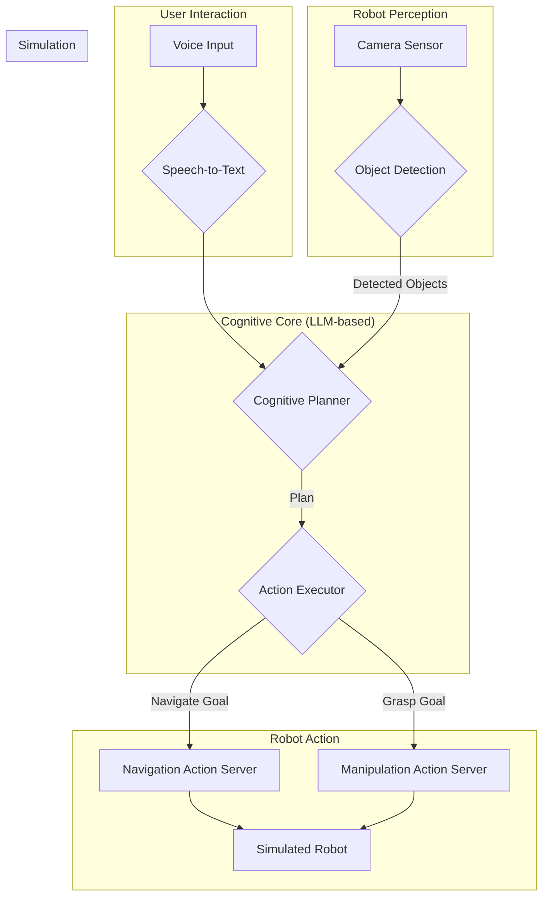

<!--
rag_chunk_id: capstone_overview
rag_chunk_title: Capstone Project Overview
rag_keywords: [capstone, project, VLA, autonomous, humanoid]
-->
# Capstone Project: Autonomous Humanoid VLA

<!--
rag_chunk_id: capstone_objectives
rag_chunk_title: Project Objectives
rag_keywords: [objectives, goals, integration, end-to-end, VLA]
-->
## Project Objectives

The goal of this capstone project is to bring together all the concepts from the previous four modules to create a high-level simulation of an autonomous humanoid robot performing a complex task based on a natural language command.

Our primary objectives are to:
1.  **Integrate All Modules**: Combine ROS 2, a physics simulator (like Gazebo or Isaac Sim), and a Vision-Language-Action (VLA) pipeline into a single, cohesive system.
2.  **Demonstrate End-to-End Functionality**: Show a complete "voice-to-action" loop, where a spoken command results in a physical (simulated) action by the robot.
3.  **Create a Generalizable Framework**: Build a software architecture that is modular and can be extended to new tasks and new robotic platforms.

<!--
rag_chunk_id: capstone_scope
rag_chunk_title: Project Scope
rag_keywords: [scope, in-scope, out-of-scope, simulation, conceptual]
-->
## Scope

For this project, we will scope the task to a common household chore: **"Clean up the table."**

This seemingly simple command requires a sophisticated combination of skills:

-   **Perception**: The robot must be able to identify the table and any objects on it (e.g., "soda_can", "apple").
-   **Reasoning**: It must understand what "clean up" means in this context (i.e., pick up the objects and move them to a designated location, like a trash bin).
-   **Planning**: It must generate a sequence of actions: navigate to the table, identify an object, pick it up, navigate to the trash bin, drop the object, and repeat until the table is clear.
-   **Action**: It must physically execute this plan, controlling its navigation and manipulation capabilities.

### In-Scope
-   Simulation-only: All tasks will be performed in a simulated environment (Gazebo or Isaac Sim).
-   High-level control: We will focus on the AI and planning logic, not on low-level motor control or physics. We will assume the existence of stable navigation and grasping action servers.
-   Conceptual implementation: The focus is on the architecture and data flow, using the conceptual nodes we designed in Module 4.

### Out-of-Scope
-   Physical hardware implementation.
-   Training new deep learning models from scratch. We will assume pre-trained models for object detection, STT, and the LLM.
-   Advanced error recovery (e.g., what to do if an object is dropped). Our focus is on the "happy path" execution.

<!--
rag_chunk_id: capstone_architecture
rag_chunk_title: System Architecture
rag_keywords: [architecture, system design, ROS 2, nodes, data flow]
-->
## System Architecture

The system is designed as a modular, ROS 2-based architecture. Each component is a ROS 2 node (or a group of nodes) responsible for a specific part of the VLA pipeline.



### Component Breakdown:

1.  **Voice Input Node**: Captures the user's voice command and uses an external STT service to get a text transcription.
    -   *Publishes*: `/user_command` (String)

2.  **Object Detection Node**: Subscribes to the robot's camera feed and uses a pre-trained model to identify objects in the scene.
    -   *Subscribes*: `/camera/image_raw` (Image)
    -   *Publishes*: `/detected_objects` (Custom message with object names and positions)

3.  **Cognitive Planner Node**: The "brain" of the system.
    -   *Subscribes*: `/user_command` and `/detected_objects`.
    -   *Functionality*: Constructs a prompt for the LLM based on the user command and the current scene. Sends the prompt to the LLM API and parses the response to get a sequence of actions.
    -   *Publishes*: `/robot_plan` (a sequence of actions)

4.  **Action Executor Node**: The bridge between the cognitive plan and the robot's physical abilities.
    -   *Subscribes*: `/robot_plan`.
    -   *Functionality*: Iterates through the plan and makes calls to the appropriate ROS 2 Action Servers to execute each step (e.g., navigate, pick, place).

5.  **Action Servers (Navigation & Manipulation)**: These are standard ROS 2 action servers that abstract the robot's low-level controllers. We assume these exist and can be called by the Action Executor.

6.  **Simulation Environment**: Gazebo or Isaac Sim, which contains the simulated robot, sensors, and objects. The simulator's ROS 2 plugins expose the robot's sensors and actuators via ROS topics and services.

<!--
rag_chunk_id: capstone_guide
rag_chunk_title: Step-by-Step Guide
rag_keywords: [guide, example, workflow, data flow, voice command, planning, execution]
-->
## Step-by-Step Guide: "Clean up the table"

Let's walk through an example of how the system would handle the command: **"Clean up the table."**

### Step 1: Voice Command and Transcription
1.  The user speaks the command.
2.  The **Voice Input Node** captures the audio, sends it to a Speech-to-Text service, and receives the string `"Clean up the table."`
3.  The node publishes this string to the `/user_command` topic.

### Step 2: Perception and Scene Understanding
1.  Meanwhile, the robot is looking at the scene. The **Object Detection Node** is processing the `/camera/image_raw` topic.
2.  It identifies a soda can and an apple on the table.
3.  It publishes this information to the `/detected_objects` topic. The `Cognitive Planner Node` now knows what is in the scene.

### Step 3: Cognitive Planning (The LLM Query)
1.  The **Cognitive Planner Node** receives the command `"Clean up the table."` on the `/user_command` topic.
2.  It constructs a detailed prompt for the LLM, which looks something like this:
    ```
    You are a helpful robot assistant. Your task is to break down a high-level user command into a sequence of simple actions.

    Your available actions are:
    - navigate(location): Locations are 'table', 'trash_bin'.
    - pickup(object): Picks up an object.
    - place(location): Places the held object at a location.

    You currently see the following objects: ["soda_can", "apple"].

    The user command is: "Clean up the table."

    Provide a plan as a JSON array of actions.
    ```
3.  The LLM receives this prompt and uses its reasoning ability to infer that "Clean up" means moving the items to the "trash_bin". It returns a JSON response:
    ```json
    [
      {"name": "navigate", "params": ["table"]},
      {"name": "pickup", "params": ["soda_can"]},
      {"name": "navigate", "params": ["trash_bin"]},
      {"name": "place", "params": []},
      {"name": "navigate", "params": ["table"]},
      {"name": "pickup", "params": ["apple"]},
      {"name": "navigate", "params": ["trash_bin"]},
      {"name": "place", "params": []}
    ]
    ```
4.  The `CognitivePlannerNode` parses this JSON and begins publishing the actions, one by one, to the `/robot_plan` topic.

### Step 4: Action Execution
1.  The **Action Executor Node** receives the first action: `{"name": "navigate", "params": ["table"]}`.
2.  It calls the `navigate_to_pose` action server, providing the coordinates of the "table".
3.  The navigation stack moves the simulated robot to the table. When the action is complete, the `ActionExecutorNode` is ready for the next step.
4.  It receives the next action: `{"name": "pickup", "params": ["soda_can"]}`.
5.  It calls the `pickup` action server. The manipulation stack executes the grasping motion.
6.  This process repeats for all steps in the plan until the table is clear.

This sequence demonstrates the power of the VLA architecture, orchestrating perception, reasoning, and action to accomplish a complex, high-level goal.

<!--
rag_chunk_id: capstone_integration_notes
rag_chunk_title: Integration Notes
rag_keywords: [integration, ROS 2, simulator, Isaac Sim, Gazebo, VLA]
-->
## Integration Notes

The success of this capstone project hinges on the seamless integration of three core technologies: ROS 2, a Simulator (Isaac Sim or Gazebo), and the VLA components (LLM, STT, etc.).

### ROS 2: The Communication Backbone
-   **Role**: ROS 2 is the glue that holds the entire system together. Every component, from the lowest-level sensor driver to the highest-level planner, is a ROS 2 node.
-   **Integration**: Communication happens exclusively through ROS 2 topics, services, and actions. This decouples the components, allowing them to be developed, tested, and replaced independently. For example, the `Cognitive Planner` doesn't need to know if the `Object Detector` is a real node or a mock, as long as it publishes to the `/detected_objects` topic.

### Simulator: The Virtual World
-   **Role**: The simulator provides a safe, fast, and measurable environment for the robot to exist in. It is responsible for physics, sensor data generation, and robot state updates.
-   **Integration (Isaac Sim/Gazebo)**: The simulator integrates with ROS 2 via a **ROS Bridge**.
    -   Sensor plugins (e.g., `libgazebo_ros_camera.so` in Gazebo) publish simulated sensor data directly to ROS 2 topics.
    -   Control plugins subscribe to ROS 2 topics (like `/cmd_vel`) and translate those commands into forces or joint movements in the simulation.

### VLA Components: The Intelligence
-   **Role**: The VLA components provide the cognitive intelligence for the system.
-- **Integration**: These are typically standard ROS 2 nodes that communicate with external, web-based APIs.
    -   The `VoiceInputNode` might use a Python library to stream audio data to the Whisper API.
    -   The `CognitivePlannerNode` will use a library like `httpx` or `requests` to make POST requests to the LLM's API endpoint, with the prompt in the request body. The integration point is a simple, well-defined web API call.

The modularity of this architecture is its key strength. The LLM can be swapped out, the simulator can be changed, and the entire system can be moved to a physical robot by replacing the simulation-specific nodes (the ROS bridge) with hardware drivers, all without changing the core logic of the VLA pipeline.

<!--
rag_chunk_id: capstone_assessment
rag_chunk_title: Assessment Criteria
rag_keywords: [assessment, criteria, grading, rubric, evaluation]
-->
## Assessment Criteria

A successful implementation of this capstone project would be assessed on the following criteria:

**1. System Integration (40%)**
-   [ ] All described ROS 2 nodes are created and are communicating via the correct topics.
-   [ ] The chosen simulator (Gazebo or Isaac Sim) is successfully launched and integrated with the ROS 2 network.
-   [ ] The VLA components (LLM, STT) are successfully integrated into their respective nodes.

**2. End-to-End Functionality (40%)**
-   [ ] The system correctly transcribes a spoken command.
-   [ ] The system generates a logical, multi-step plan based on the command and perceived objects.
-   [ ] The robot successfully begins to execute at least the first two steps of the generated plan (e.g., navigates to the table and attempts to pick up an object).

**3. Code Quality and Documentation (20%)**
-   [ ] The code is clean, well-commented, and follows standard ROS 2 best practices.
-   [ ] The role and function of each node are clearly documented.
-   [ ] A `README.md` file is provided with clear instructions on how to launch and run the entire system.
